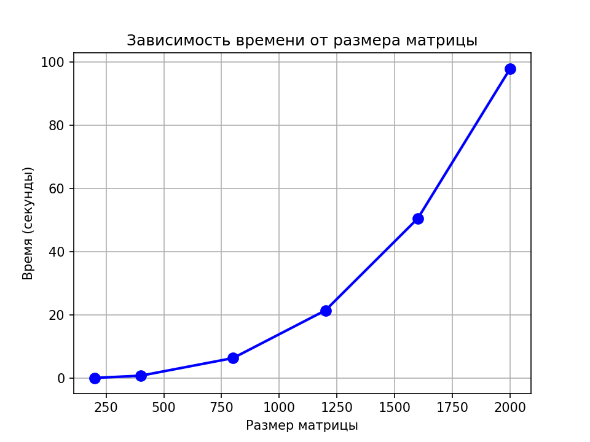

# Лабораторная работа №1

## 1. Задание:
Написать программу на языке C/C++ для перемножения двух квадратных матриц.
- Исходные данные: файл(ы) содержащие значения исходных матриц.
- Выходные данные: файл со значениями результирующей матрицы, время выполнения, объем задачи.
- Обязательна автоматизированная верификация результатов вычислений с помощью сторонних библиотек или стороннего ПО (например на Matlab/Python).

## 2. Программа:
- `generate_matrices.py` - генерация случайных матриц
- `lab_1.cpp` - умножение матриц
- `verify.py` - верификация

## 3. Эксперименты с разными размерами матриц
| Размер матрицы | Время (с) | Операций |
|----------------|-----------|----------|
| 200 × 200 | 0.11 | 16×10⁶ |
| 400 × 400 | 0.81 | 128×10⁶ |
| 800 × 800 | 6.38 | 1024×10⁶ |
| 1200 × 1200 | 21.46 | 3456×10⁶ |
| 1600 × 1600 | 50.53 | 8192×10⁶ |
| 2000 × 2000 | 97.89 | 16000×10⁶ |

## 4. Выводы
- Время выполнения растёт пропорционально O(n³), что соответствует теоретической сложности алгоритма  
- Верификация подтверждает корректность всех вычислений

