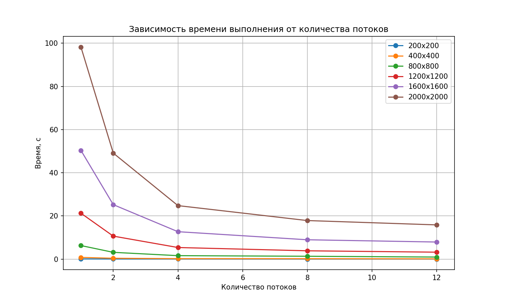

# Лабораторная работа №2

## 1. Задание:
Модифицировать программу из л/р №1 для параллельной работы по технологии OpenMP.
- Провести эксперименты с разным количеством потоков (1, 2, 4, 8, 12)
- Разные размеры матриц (200, 400, 800, 1200, 1600, 2000)

## 2. Программа:
- `generate_matrices.py` - генерация случайных матриц
- `lab_2.cpp` - параллельное умножение матриц (OpenMP)
- `verify.py` - верификация

## 3. Эксперименты

12 вычислительных ядер, количество потоков: 1, 2, 4, 8, 12
### Время выполнения (секунды)

| Размер | 1 поток | 2 потока | 4 потока | 8 потоков | 12 потоков |
|--------|---------|----------|----------|-----------|------------|
| 200 | 0.10 | 0.05 | 0.03 | 0.02 | 0.02 |
| 400 | 0.79 | 0.39 | 0.20 | 0.18 | 0.12 |
| 800 | 6.28 | 3.14 | 1.60 | 1.32 | 0.95 |
| 1200 | 21.26 | 10.65 | 5.37 | 3.85 | 3.21 |
| 1600 | 50.38 | 25.23 | 12.70 | 8.96 | 7.91 |
| 2000 | 98.27 | 49.11 | 24.78 | 17.86 | 15.85 |

## 4. Выводы
- Увеличение количества потоков значительно сокращает время вычислений
- Наибольший эффект от параллелизации наблюдается на больших матрицах
- Верификация подтверждает корректность всех вычислений
