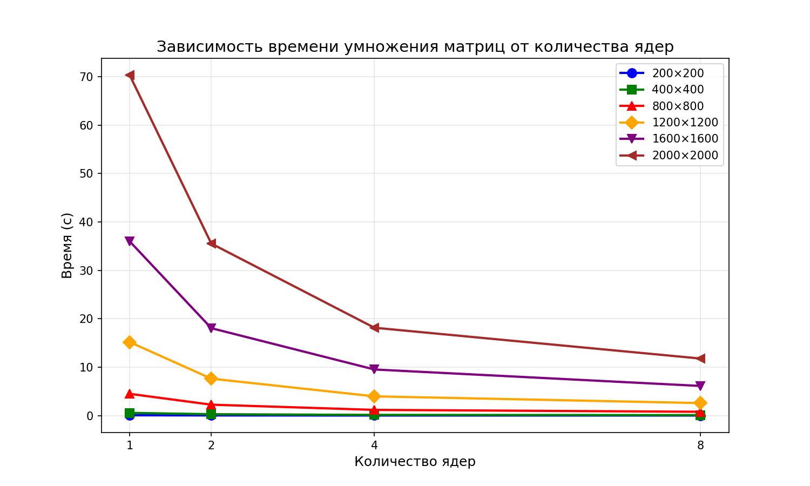

# Лабораторная работа №3

## 1. Задание:
Модифицировать программу из л/р №1 для параллельной работы по технологии MPI.
- Провести эксперименты с разными размерами матриц (200, 400, 800, 1200, 1600, 2000)
- Разное количество вычислительных ядер (1, 2, 4, 8).

## 2. Программа:
- `generate_matrices.py` - генерация случайных матриц
- `lab_3.cpp` - параллельное умножение матриц (MPI)
- `run_experiment.bat` - скрипт для всех экспериментов
- `verify.py` - верификация

## 3. Эксперименты

| Размер | Операций | 1 ядро | 2 ядра | 4 ядра | 8 ядер |
|--------|---------|----------|----------|-----------|------------|
| 200 | 16×10⁶ | 0.0705 с | 0.0356 с | 0.0181 с | 0.0141 с |
| 400 | 128×10⁶ | 0.5634 с | 0.2813 с | 0.1431 с | 0.0943 с |
| 800 | 1,024×10⁶ | 4.4926 с | 2.2568 с | 1.1801 с | 0.7870 с |
| 1200 | 3,456×10⁶ | 15.1784 с | 7.6327 с | 3.9783 с | 2.5852 с |
| 1600 | 8,192×10⁶ | 35.9753 с | 18.0616 с | 9.5288 с | 6.1257 с |
| 2000 | 16,000×10⁶ | 70.2930 с | 35.5355 с | 18.1546 с | 11.7866 с |

## 4. Выводы
- Параллельная версия показывает хорошее ускорение при увеличении количества ядер
- С увеличением размера матрицы эффективность параллелизации растёт
- Верификация подтверждает корректность всех вычислений
