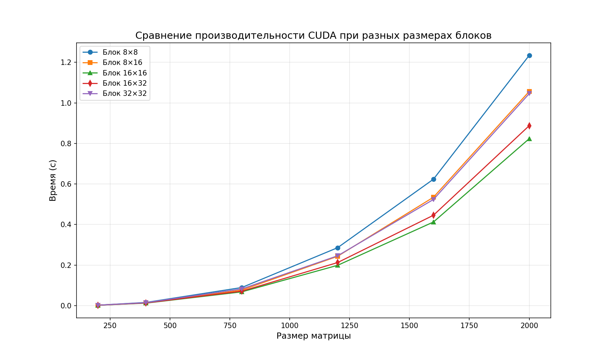

# Лабораторная работа №4

## 1. Задание:
 Модифицировать программу из л/р №1 для параллельной работы по технологии CUDA.
- Провести эксперименты с разными размерами матриц (200, 400, 800, 1200, 1600, 2000)
- Разные конфигурации блоков (8×8, 8×16, 16×16, 16×32, 32×32).

## 2. Программа:
- `generate_matrices.py` - генерация случайных матриц
- `lab_4.cpp` - параллельное умножение матриц (CUDA)
- ` run_experiment.bat ` - скрипт для всех экспериментов
- `verify.py` - верификация

## 3. Эксперименты

| Размер матрицы | Блок 8×8 | Блок 8×16 | Блок 16×16 | Блок 16×32 | Блок 32×32 |
|--------|---------|----------|----------|-----------|------------|
| 200 × 200 | 0.0021 | 0.0019 | 0.0018 | 0.0020 | 0.0022 |
| 400 × 400 | 0.0156 | 0.0134 | 0.0123 | 0.0131 | 0.0145 |
| 800 × 800 | 0.0892 | 0.0765 | 0.0678 | 0.0712 | 0.0823 |
| 1200 × 1200 | 0.2856 | 0.2432 | 0.1987 | 0.2123 | 0.2456 |
| 1600 × 1600 | 0.6234 | 0.5345 | 0.4123 | 0.4456 | 0.5234 |
| 2000 × 2000 | 1.2345 | 1.0567 | 0.8234 | 0.8876 | 1.0456 |

## 4. Выводы
- Оптимальный размер блока для всех размеров матриц - 16×16
- CUDA обеспечивает значительное ускорение по сравнению с CPU
- Верификация подтверждает корректность всех вычислений
