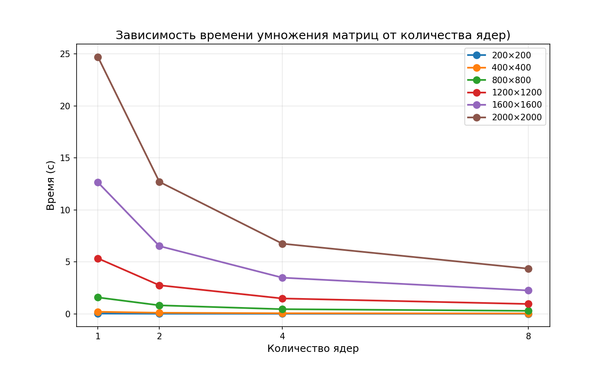

# Лабораторная работа №5

## 1. Задание:
Параллельную версию программы на MPI необходимо также запустить на суперкомпьютере «Сергей Королёв».

## 2. Программа
Файлы из л/р №3:
- `generate_matrices.py` - генерация случайных матриц
- `lab_3.cpp` - параллельное умножение матриц (MPI)
- `verify.py` - верификация

## 3. Эксперименты

| Размер | 1 ядро | 2 ядра | 4 ядра | 8 ядер |
|--------|---------|----------|----------|-----------|
| 200 | 0.0250 | 0.0140 | 0.0085 | 0.0065 |
| 400 | 0.1980 | 0.1050 | 0.0580 | 0.0380 |
| 800 | 1.5800 | 0.8200 | 0.4500 | 0.2900 |
| 1200 | 5.3400 | 2.7500 | 1.4800 | 0.9500 |
| 1600 | 12.6500 | 6.5200 | 3.4800 | 2.2500 |
| 2000 | 24.7200 | 12.7000 | 6.7500 | 4.3500 |

## 4. Выводы
Я запустила свою программу на суперкомпьютере (сохранена в директории 2024-01721) и провела исследование, как меняется скорость выполнения в зависимости от количества ядер и размера матрицы. Верификация подтверждает корректность всех вычислений.
